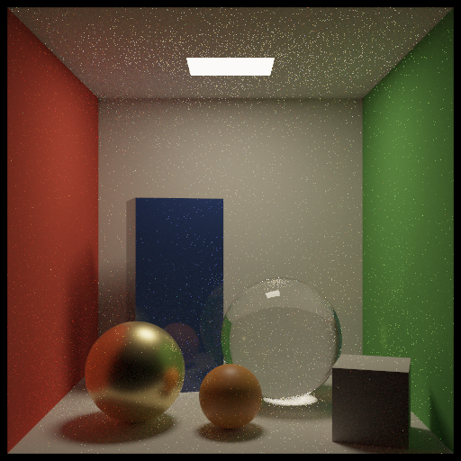

# luce-render design

luce-render is a spectral path tracer that runs only on the GPU. The host, in
Luce Base, compiles a luce-geocore `GeometrySet` into buffers and records
compute passes on luce-gpu. All tracing happens in GLSL compute kernels: Metal
on macOS, Vulkan on Windows and Linux. There is no CPU renderer, and none is
planned.

The decisions below come from a source study of Cycles X, pbrt-v4, OpenPBR and
OpenPGL. [research/RENDERER-STUDY.md](research/RENDERER-STUDY.md) has the
citations and the alternatives. The references were studied, not copied: all
code here is our own.

## Goals

- **Fast:** a wavefront integrator, hardware ray queries where the GPU has them,
  a light tree, adaptive sampling, and later path guiding.
- **Correct color:** spectral by default, with a RGB build of the same code. The
  film is in XYZ, converted to ACEScg. Tone mapping happens downstream (luce-color,
  ACES 2.0).
- **One material model for now:** OpenPBR Surface. Shader assignment comes later.
- **One of several engines:** luced-3d's Render node picks the engine. luce-render
  is the first, behind the same scene description (USD-shaped cameras and lights in
  the GeometrySet).

## Scene

`compile_scene` produces the following (`src/render/scene.lucb`):

- **Triangles:** world-space points, three indices per triangle, and each
  triangle's polygon. Visible instances are realized. Analytic CAD is skipped until a
  Tessellate node; `skipped` counts it.
- **Cameras and lights:** flattened to world space from the scene component.
  Cameras follow UsdGeomCamera; lights follow UsdLux rect, disk, sphere and distant.
- **The BVH:** binned SAH, binary, with a 32-byte node (`src/render/bvh.lucb`). This
  is the software path. Ray queries (luce-gpu Tier B) replace it where the GPU
  supports them, with a two-level hierarchy of one BLAS per prototype and a TLAS of
  instances.

Planned layout changes for the integrator:

- **Triangle vertices:** pre-gathered as 3×vec4 per triangle, so intersection reads
  one place.
- **Per-vertex attributes:** octahedral normals and UVs.
- **Per-triangle material id.**
- **No `vec3[]` arrays:** std430 pads each element to 16 bytes.

## Spectral and RGB from one code path

All tracing code works on a `Spec` type:

```glsl
#if SPECTRAL
#define Spec vec4   // four wavelengths: one sampled, three rotated across 360–830 nm
#else
#define Spec vec3   // linear ACEScg
#endif
```

`tools/build_kernels.py` builds every tracing kernel twice, with `-DSPECTRAL=1`
and `-DSPECTRAL=0`. The Render node's Color menu chooses between them. The rules:

- **Wavelengths:** each path carries four hero-rotated wavelengths. They are drawn
  from pbrt's analytic visible-wavelength pdf, using one camera sample dimension.
- **Probabilities are scalars.** Lobes and lights are chosen from wavelength-free
  values (the luminance of their RGB parameters), so MIS weights never depend on the
  wavelength.
- **RGB parameters become spectra** through Jakob–Hanika sigmoid coefficients
  (c0, c1, c2, scale). The tables are built offline for ACEScg and Rec.709, each
  64³. In the RGB build the same parameters are read as plain RGB.
- **Dispersion:** a dispersive interface ends the three secondary wavelengths.
  Their lanes go to zero and lane 0 is weighted ×4.
- **Lights:** emitter radiance is normalized so OpenPBR's `emission_luminance`
  (nits) lands on Y. Blackbody temperature is evaluated per wavelength.
- **Film:** accumulates XYZ through the CIE 1931 2° curves at 1 nm, then converts
  to ACEScg. The RGB build accumulates ACEScg directly.

## Integrator: wavefront on queues

Each pass traces one sample per pixel. The path pool defaults to 2^20 paths, and
the image is covered in bands when it has more pixels than that. Per-path state
lives in one buffer as an array per field, the layout Cycles uses. It is bound
twice, once as `uint[]` and once as `vec4[]`, with field offsets in the
constants. That fits luce-gpu's 16 bindings until buffer device addresses
arrive. The state takes about 216 bytes per path: 128 main, 64 shadow and 24 of
queues.

Kernels:

| Kernel | Does |
| --- | --- |
| `schedule` | One thread. Turns queue counters into indirect dispatch arguments and clears the next ones, so the host never reads back between kernels. |
| `camera` | Fills free paths: pixel and filter sample, wavelengths, thin-lens ray. Skips converged pixels. |
| `intersect_closest` | Traces the BVH or a ray query. Applies Russian roulette. Sends each path to the surface queue or the miss queue. |
| `shade_surface` | OpenPBR: emission with MIS, a light-tree light sample (shadow ray in the same slot as its path), a BSDF sample, and the denoiser's albedo and normal at the first diffuse vertex. |
| `shade_miss` | Distant lights and background. Writes the path to the film and frees it. |
| `intersect_shadow` | Any hit, opaque only in v1. |
| `shade_shadow` | Adds an unoccluded light sample to its path's radiance. No atomics, since the slot is the path's own. |
| `film_convert` | Divides by the sample count and converts XYZ to ACEScg, writing an rgba32f image. |
| `adaptive_*` | Cycles' convergence test and filter. |

The per-bounce order is fixed:

```
schedule → intersect_closest → schedule → shade_surface, shade_miss
         → schedule → intersect_shadow → schedule → shade_shadow
```

A batch records K bounces, with `camera` refilling the pool at the top of each
batch. The host reads the live count one batch behind, without waiting. Each
batch stays well under 50 ms, following luce-gpu's rule for long work: submit
the next pass only once `done()` reports the previous one finished.

Paths need no RNG state. Sobol–Burley (Owen-scrambled) draws dimension
`16·bounce + k` from the pixel and sample index, with blue-noise ordering first
for the viewport.

## Lights

- **UsdLux shapes:** rect, disk, sphere and distant, with dome later. Rect and disk
  lights are also primitives in the BVH, so BSDF rays can hit them.
- **Light tree:** pbrt-v4's light-bounds importance over a median-split binary
  tree, one emitter a leaf. It covers the lights that have a place and the emissive
  triangles. Each emitter's trail gives its pdf for MIS (light_tree.lucb,
  lighttree.glsl). Cycles' min/max importance and wider leaves can come later.
- **MIS:** power-heuristic between light sampling and BSDF sampling. Russian
  roulette, indirect clamping and filter-glossy follow Cycles.

## OpenPBR

| Stage | Lobes |
| --- | --- |
| v1 (done) | EON diffuse (energy-preserving Oren–Nayar), F82-tint metal, GGX specular with anisotropy over albedo-scaled diffuse, coat with darkening, absorption and base roughening, emission, opacity cutout, rough dielectric transmission (no interior medium; shadow rays treat glass and cut-outs as opaque) |
| v2 | transmission depth, dispersion, fuzz, thin film |
| v3 | subsurface random walk |

Energy compensation uses precomputed albedo tables (study §3.5):

- GGX E (32²) and its average;
- dielectric reflection (32×32×16);
- glass albedo (16³).

EON, fuzz and thin film are closed form and need no tables.

## Speed, later

- **Ray queries** (Metal `intersection_query` via spirv-cross; confirmed to compile),
  with BVH2 as the fallback.
- **GPU BVH refit and build** for interactive edits.
- **Sorting** the surface queue by material.
- **Path guiding:** a GPU hash grid of small von Mises–Fisher mixtures, trained on
  luminance. Russian roulette keeps the unguided throughput.
- **Viewport sampling:** ReSTIR DI for the viewport mode only.
- **Subgroup-wide queue appends** once luce-gpu has subgroups.
- **Wider nodes:** CWBVH 8-wide nodes.
- **Buffer device addresses** remove the 16-binding packing.

## Validation

- **Host:** the BVH covers every triangle once, and its boxes nest (`tests.lucb`).
- **GPU:** the probe kernel matches brute-force intersection on every pixel
  (`tests/gpu`).
- **To come:**
  - white-furnace tests per lobe;
  - spectral against RGB on non-dispersive scenes (they should agree within the
    upsampling error);
  - convergence against a reference Cornell box;
  - per-kernel timings once luce-gpu has timestamps.

## Status

v1 renders OpenPBR v1 (EON diffuse, GGX specular over it, F82 metal, coat,
rough dielectric transmission, emission, cut-out opacity) with per-face material
binding, UsdLux lights and emissive meshes. Light samples come from a light tree
over every emitter (power-chosen distant lights aside), MIS-weighted against BSDF
samples through trail-recomputed tree pdfs. It has an indirect clamp, per-kind
bounce limits, hardware ray queries with the software BVH as fallback, and
spectral and RGB builds.

GPU tests check it against closed forms or self-consistency:

- **White furnaces:** diffuse under specular, rough EON, rough metal, coat, smooth
  glass.
- **Cut-out opacity.**
- **Emission.**
- **Assigned materials.**
- **Rect light and emissive quad irradiance:** both against the closed form.
- **Spectral against RGB.**
- **Ray queries against the BVH.**

**Speed:** about 9 ms a 1080p spectral sample at 12 bounces on an M4 Max.

Since then:

- **Adaptive sampling:** Cycles' half-buffer metric with a 3 × 3 widened
  stop.
- **Cut-out shadows.**
- **Per-kernel GPU timings.**
- **Path guiding v1** (shaders/guide.glsl), after REALTIME-STUDY §3.1:
  - a world-space hash grid of 4-lobe vMF mixtures, with cells sized by the
    camera footprint;
  - trained on cosine-weighted incident luminance from each path's first
    vertices, fitted once a pass;
  - one-sample MIS with the BSDF, with Russian roulette on the unguided
    throughput.

  It is off by default. In a room lit by a ceiling spot it cuts error 1.22× at
  equal samples, and costs about 25% a sample (2.5 ms at 1080p). Making it pay
  everywhere comes next:
  - cheaper training: subgroup-aggregated atomics, or a fraction of paths once
    the fit is stable;
  - soft EM, product with the BSDF, MI reweighting of training passes, and
    illumination-aware cells.

Performance, after BACKENDS-STUDY.md:

- **Keep the portable layer.** Dispatch overhead is small, about 3.5 µs a
  dependent dispatch; one bounce already costs 80% of a 12-bounce sample.
- **Fast math** on the shading kernels: 9.0 to 8.3 ms.
- **Scene specialization:** material features, cut-outs, guiding and the light
  count become specialization constants. Shading drops 3.3 to 2.1 ms, the
  sample 8.4 to about 7.2 ms spectral and 7.8 to 6.6 ms RGB, at 1080p on an
  M4 Max.

- **No separate scheduling kernel.** Each kernel's last workgroup writes the
  next kernels' indirect arguments, so a round is 4 dispatches instead of 7:
  ~7.1 to 6.9 ms.
- **Mid-pass path refill: not done, as it doesn't pay here.** Going from 4 to 12
  bounces costs only 0.35 ms (5%), the most refill could recover; tail rounds
  are real work.
- **Material sorting: waits** for multi-material benchmark scenes. Every test
  scene has one material, where sorting only costs.

## Benchmark: the Cornell box

`tests/cornell` is the scene optimizations are judged on: a Cornell box (red
and green walls, white floor, ceiling and back, a warm ceiling area light) with
a blue clear-coated box, a smooth glass ball, a rough gold ball, an orange rough
plastic ball and a white cube. That's 11,938 triangles and seven materials,
with colour bleeding, refraction, a caustic under the glass, glossy
interreflection and coat.



`luc test` renders 512 × 512 at 128 samples into build/cornell.ppm and prints
the time. `LUCE_BENCH=1 build/luc-test/cornell/cornell` adds 1024 × 1024 timings
and the error after equal samples against a 4096-sample reference, with and
without guiding.

First numbers, on an M4 Max:

| Measure | Value |
| --- | --- |
| 1024 × 1024, spectral | 8.1 ms a sample |
| 1024 × 1024, RGB | 7.1 ms a sample |
| 256 × 256, 256 samples, unguided | MSE 0.0078 at 1.39 ms a sample |
| 256 × 256, 256 samples, guided | MSE 0.0076 at 2.08 ms a sample (worse at equal time) |

## Light tracing

Caustics made the Cornell box's fireflies: light focused through the glass
ball onto the floor, seen directly or after a bounce. Shadow rays cannot
follow refraction, so camera paths found that light only by a lucky BSDF ray
through the ball onto the small lamp. A clamp hid the fireflies by deleting
59% of the caustic. [research/FIREFLIES-STUDY.md](research/FIREFLIES-STUDY.md)
has the measurements and the literature.

Light paths fix it without bias (`RenderSettings.light_tracing`, light paths a
pixel a sample, 0.5 by default; the Render node's "Light paths"):

- **Where they run:** in the camera paths' wavefront. They take the pool's
  slots after the band's camera paths; `light_emit` starts them in the first
  band's pass, and they share the rounds. `shade_surface` shades both kinds in
  one dispatch, so their latencies overlap.
- **What they do:** start at an emitter chosen by power, at a point by area,
  in a cosine direction. At every surface they connect to the camera with a
  shadow ray, and `intersect_shadow` splats what gets through atomically on a
  fourth film plane. `film_convert` adds the splats over the light-tracing
  samples taken.
- **MIS over three techniques** (shaders/connect.glsl): the camera's BSDF hit
  on a light, its light sample, and the light path's camera connection, each
  weighed by the power heuristic over all three. Both sides carry the ratio of
  the other side's path density to their own, settling each vertex's factor
  once the direction beyond it is known. Light paths choose lobes by Fresnel
  at normal incidence (`light_lobes`), so camera paths compute their reverse
  pdfs without tables.
- **Transport:** light paths weigh each bounce by the BSDF as the camera
  evaluates it (radiance transport), with Veach's shading-normal correction.
- **Visibility reads the same both ways:** light paths cross flat lights the
  mirror way of camera rays, and a camera connection stops at a visible light
  the camera's ray would hit first.

Checked against closed forms (rect light and emissive quad with light paths)
and against path tracing: the all-diffuse Cornell box agrees to 0.01%, and the
lamp-in-a-shade room converges 22x lower MSE at equal samples.

## Benchmark: the Cornell box, now

512 × 512, 12 bounces, spectral, M4 Max (another GPU app running, so absolute
times are about 15% high). Error is relative MSE against a 16384-sample
light-traced reference; "trimmed" drops the worst 0.1% of pixels.

| Light paths a pixel | ms a sample | relMSE at 512 samples | relMSE x time | trimmed x time |
| --- | --- | --- | --- | --- |
| 0 (path tracing) | 3.14 | 0.0392 | 0.123 | 0.090 |
| 0.1 | 3.94 | 0.0086 | 0.034 | 0.016 |
| 0.25 | 4.25 | 0.0059 | 0.025 | 0.012 |
| 0.5 (default) | 4.79 | 0.0041 | 0.020 | 0.011 |
| 1 | 5.88 | 0.0033 | 0.020 | 0.011 |

Light tracing is about 6x more efficient at equal time (8x trimmed, 11x
outside the glass ball). What noise is left is in caustics seen through glass
(the ball's inside, the clear coat's reflection), which neither technique can
sample: manifold next-event estimation is the next step for those
(REALTIME-STUDY §3.6). Path guiding trained from light paths too (Vorba 2014)
was tried and did not pay: it doubled the error on the gold and the coat.

Next:
- Manifold sampling for caustics seen through glass.
- A denoiser.
- Instancing as a BLAS per prototype.
